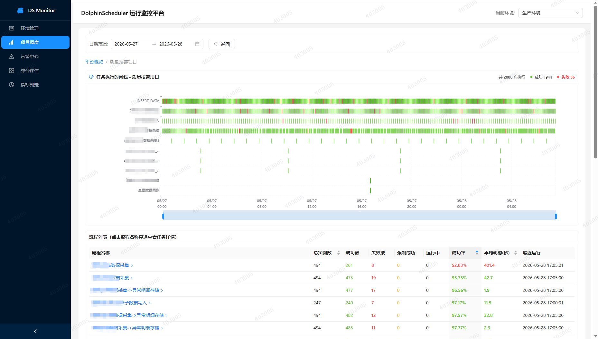
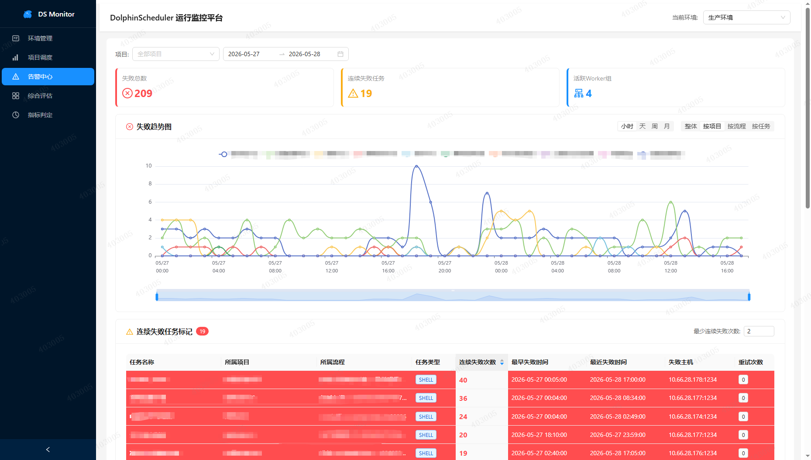
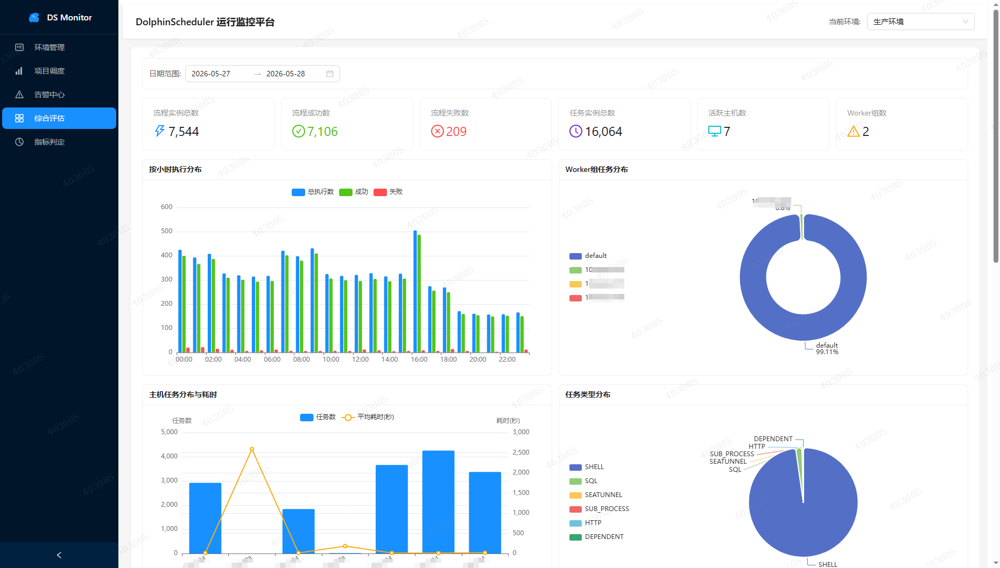

# DolphinScheduler Monitor

DolphinScheduler 运行监控平台 — 一个基于 Web 的 Apache DolphinScheduler 任务运行状态监控与分析系统。

## 界面预览

<table>
  <tr>
    <td align="center"><br/>综合评估</td>
    <td align="center"><br/>告警中心</td>
  </tr>
  <tr>
    <td align="center"><br/>项目调度</td>
  </tr>
</table>

## 功能特性

- **综合评估** — 多维度指标评分与可视化仪表盘，全局掌握调度健康状态
- **环境管理** — 配置多个 DolphinScheduler 数据库连接（MySQL / Doris），支持多环境切换
- **项目调度** — 查看各项目下的工作流实例统计，快速定位调度问题
- **告警中心** — 失败趋势分析（小时/天/周/月维度）、项目筛选、告警规则管理
- **指标判定** — 自定义指标阈值与评分规则，灵活适配不同业务场景

## 技术栈

| 层级 | 技术 |
|------|------|
| 前端 | React 19 + TypeScript + Ant Design 5 + ECharts 5 + Vite 6 |
| 后端 | Node.js + Express 5 + TypeScript + MySQL2 + SQLite (sql.js) |
| 构建 | Vite (前端) + tsc (后端) |

## 快速开始

### 环境要求

- Node.js 18+
- npm 9+
- 可访问的 DolphinScheduler MySQL/Doris 元数据库

### 安装与启动

```bash
# 克隆仓库
git clone https://github.com/wuwensheng1/dolphinscheduler-monitor.git
cd dolphinscheduler-monitor

# 安装后端依赖
cd server
npm install

# 安装前端依赖
cd ../client
npm install

# 启动后端服务（开发模式，支持热重载）
cd ../server
npm run dev

# 启动前端开发服务器（新终端）
cd client
npm run dev
```

启动后访问 http://localhost:5173

### 生产构建

```bash
# 编译后端
cd server
npx tsc

# 构建前端
cd ../client
npx vite build

# 将前端产物复制到后端
rm -rf ../server/client && cp -r ../client/dist ../server/client

# 启动生产服务
cd ../server
node dist/index.js
```

## 项目结构

```
dolphinscheduler-monitor/
├── client/                  # 前端项目
│   ├── src/
│   │   ├── components/      # 公共组件
│   │   ├── layouts/         # 布局组件
│   │   ├── pages/           # 页面组件
│   │   │   ├── DashboardPage.tsx      # 综合评估
│   │   │   ├── EnvironmentPage.tsx    # 环境管理
│   │   │   ├── ProjectPage.tsx        # 项目调度
│   │   │   ├── AlertCenterPage.tsx    # 告警中心
│   │   │   └── IndicatorPage.tsx      # 指标判定
│   │   └── services/        # API 服务
│   ├── package.json
│   └── vite.config.ts
├── server/                  # 后端项目
│   ├── src/
│   │   ├── routes/          # API 路由
│   │   ├── utils/           # 工具函数（数据库连接等）
│   │   ├── app.ts           # Express 应用
│   │   └── index.ts         # 入口文件
│   ├── package.json
│   └── tsconfig.json
├── build.bat                # Windows 一键构建脚本
├── start.sh                 # Linux 启动脚本
├── mac-start.sh             # Mac 终端模式启动
├── mac-stop.sh              # Mac 停止服务
├── mac-launch.sh            # Mac 后台启动+自动打开浏览器
└── DEPLOY.md                # 详细部署文档
```

## 配置

### 端口

默认端口 `3001`，可通过环境变量修改：

```bash
PORT=8080 node dist/index.js
```

### 数据库连接

首次启动后通过 Web 界面添加 DolphinScheduler 数据库连接：环境管理 → 添加环境 → 填写连接信息。

## 部署

详细的部署指南（Windows 便携部署、Linux systemd 服务、Nginx 反向代理等）请参阅 [DEPLOY.md](./DEPLOY.md)。

## License

[MIT](./LICENSE)
